## Introduction

In this project, I will be further exploring `gapminder` dataset. Specifically, I will show you how to: 
(1) Find the maximum and minimum of `gdpPercap` for all continents;
(2) Find the spread of `gdpPercap` within the continents;
(3) Compute a trimmed mean and a weighted mean of `lifeExp`;
(4) See how `lifeExp` changes over time on different continents;
(5) Report the relative abundance of countries with low `lifeExp` over time by continent.

## Setting up access to the dataset, downloading needed packages

I will be analyzing the gapminder dataset. First, load the `gapminder` R package. Also load tidyverse package - this will also load ggplot2 and dplyr.


```r
suppressPackageStartupMessages(library(gapminder))
```

```
## Warning: package 'gapminder' was built under R version 3.5.1
```

```r
suppressPackageStartupMessages(library(tidyverse))
```

```
## Warning: package 'tidyverse' was built under R version 3.5.1
```

```
## Warning: package 'ggplot2' was built under R version 3.5.1
```

```
## Warning: package 'tibble' was built under R version 3.5.1
```

```
## Warning: package 'tidyr' was built under R version 3.5.1
```

```
## Warning: package 'readr' was built under R version 3.5.1
```

```
## Warning: package 'purrr' was built under R version 3.5.1
```

```
## Warning: package 'dplyr' was built under R version 3.5.1
```

```
## Warning: package 'stringr' was built under R version 3.5.1
```

```
## Warning: package 'forcats' was built under R version 3.5.1
```

## 1. The maximum and minimum of GDP per capita for all continents

### Make a table showing max and min values for `gdpPercap` by continent

```r
GDPcontinent=gapminder %>% ## create a new data-frame
  group_by(continent) %>%  ## group data by continent
    summarize(maxGDPpercap=round(max(gdpPercap),2), ## find max `gdpPercap`
              minGDPpercap=round(min(gdpPercap),2)) ## find min `gdpPercap`
```

```
## Warning: package 'bindrcpp' was built under R version 3.5.1
```

```r
knitr::kable(GDPcontinent, format = "markdown") ## knit the table
```


|continent | maxGDPpercap| minGDPpercap|
|:---------|------------:|------------:|
|Africa    |     21951.21|       241.17|
|Americas  |     42951.65|      1201.64|
|Asia      |    113523.13|       331.00|
|Europe    |     49357.19|       973.53|
|Oceania   |     34435.37|     10039.60|


Let's visualize the data to see which countries have the highest and the lowest `gdpPercap`

### Maximum `gdpPercap` for each continent

```r
GDPcontinent %>%  ## get access to the dataframe
  ggplot(aes(continent, maxGDPpercap, fill = continent, label = maxGDPpercap))+ ## specify x and y-axis, color by continent, add number values for each bar
  geom_bar(stat = "identity")+ ## make a bar chart
  labs(title="Maximum GDP per capita for continents")+ ## add a title
  geom_text(size = 3.5, position = position_stack(vjust = 0.5)) ## changing style for numbers
```

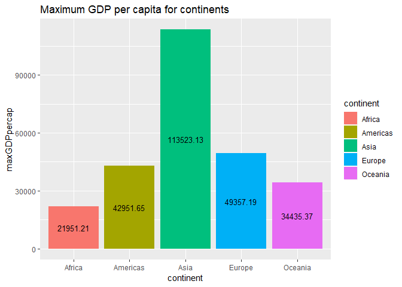<!-- -->

From this barchart, we can notice that Asia has the highest maximum `gdpPercap` among all other continents, while the lowest maximum `gdpPercap` is located in Africa.

### Minimum `gdpPercap` for each continent

```r
GDPcontinent %>%  ## get access to the dataframe
  ggplot(aes(continent, minGDPpercap, fill = continent, label = minGDPpercap))+ ## specify x and y-axis, color by continent, add number values for each bar
  geom_bar(stat = "identity")+ ## make a bar chart
  labs(title="Minimum GDP per capita for continents")+ ## add a title
  geom_text(size = 3.5, position = position_stack(vjust = 0.5)) ## changing style for numbers
```

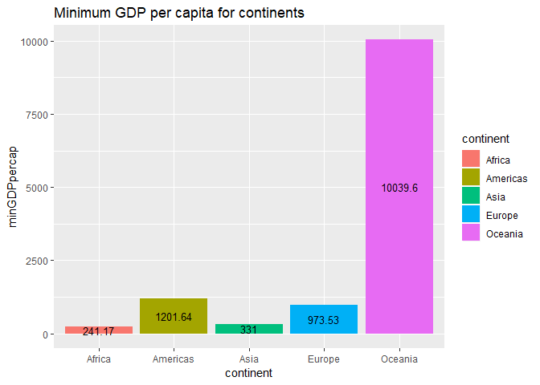<!-- -->

From this barchart, we can notice that Oceania has the highest minimum `gdpPercap` among all other continents, while the lowest minimum `gdpPercap` is located in Africa.

## 2. The spread of GDP per capita within the continents

### Make a boxplot of `gdpPercap` for each continent with jitter points

```r
ggplot(gapminder, aes(continent, gdpPercap, fill=continent))+ ## identify x and y-axis, color by continent
  scale_y_log10()+ ## use log 10 scale for GDP per capita variable
  geom_boxplot()+ ## add a boxplot
  geom_jitter(alpha=0.15)+ ## add jitter points with alpha 0.15
  labs(title="Boxplots and jitterplots of GDP per capita by continent") ## add a title
```

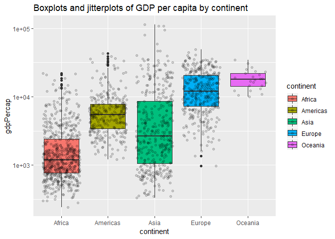<!-- -->

We can notice that Asia has the highest net spread(range), while data of Africa, Americas, Europe and Oceania tends to be more clustered. Let's compute spread statistics by continent to know with certainty where every continent stands.


### Calculate standard deviation, range and IQR of `gdpPercap` by continent

```r
GDPcontinentSpread = gapminder %>% ##create a new data-frame
  group_by(continent) %>% ## group data by continent
    summarize(StDevGDPpercap=round(sd(gdpPercap),2), ## find StDev of `gdpPercap`
              RangeGDPpercap=round(max(gdpPercap)-min(gdpPercap),2), ## find range of `gdpPercap`
              IQRgdpPercap=round(IQR(gdpPercap),2)) ## find IQR of `gdpPercap`

knitr::kable(GDPcontinentSpread, format = "markdown") ## knit the table
```


|continent | StDevGDPpercap| RangeGDPpercap| IQRgdpPercap|
|:---------|--------------:|--------------:|------------:|
|Africa    |        2827.93|       21710.05|      1616.17|
|Americas  |        6396.76|       41750.02|      4402.43|
|Asia      |       14045.37|      113192.13|      7492.26|
|Europe    |        9355.21|       48383.66|     13248.30|
|Oceania   |        6358.98|       24395.77|      8072.26|

### StDev of `gdpPercap` for each continent

```r
GDPcontinentSpread %>% ## get access to the dataframe
  ggplot(aes(continent, StDevGDPpercap, fill=continent, label = StDevGDPpercap))+ ## specify x and y-axis, color by continent, add number values for each bar
  geom_bar(stat = "identity")+ ## make a bar chart
  labs(title="Standard deviation of GDP per capita for continents")+ ## add a title
  geom_text(size = 3.5, position = position_stack(vjust = 0.5)) ## changing style for numbers
```

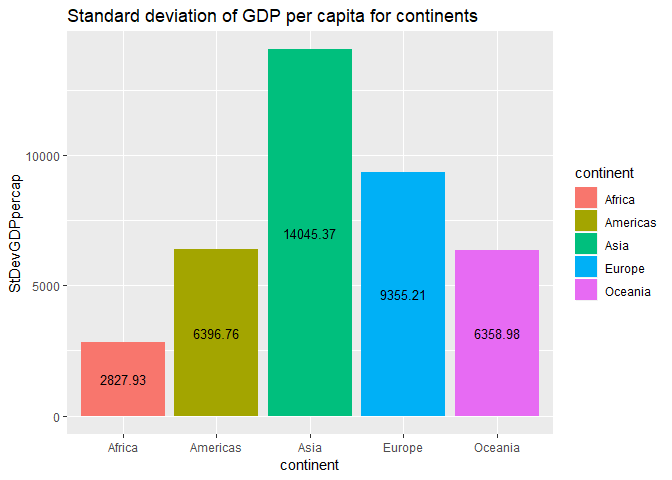<!-- -->

From this barchart, we can notice that Asia has the highest standard deviation of `gdpPercap` among all other continents, while the lowest standard deviation of `gdpPercap` belongs to Africa.

### Range of `gdpPercap` for each continent

```r
GDPcontinentSpread %>% ## get access to the dataframe
  ggplot(aes(continent, RangeGDPpercap, fill=continent, label = RangeGDPpercap))+ ## specify x and y-axis, color by continent, add number values for each bar
  geom_bar(stat = "identity")+ ## make a bar chart
  labs(title="Range of GDP per capita for continents")+ ## add a title
  geom_text(size = 3.5, position = position_stack(vjust = 0.5)) ## changing style for numbers
```

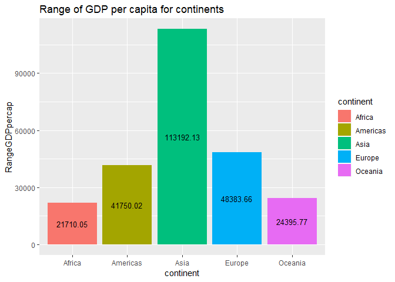<!-- -->

From this barchart, we can notice that Asia has the highest range of `gdpPercap` among all other continents, while the lowest range of `gdpPercap` belongs to Africa.

### IQR of `gdpPercap` for each continent

```r
GDPcontinentSpread %>% ## get access to the dataframe
  ggplot(aes(continent, IQRgdpPercap, fill=continent, label = IQRgdpPercap))+ ## specify x and y-axis, color by continent, add number values for each bar
  geom_bar(stat = "identity")+ ## make a bar chart
  labs(title="IQR of GDP per capita for continents")+ ## add a title
  geom_text(size = 3.5, position = position_stack(vjust = 0.5)) ## changing style for numbers
```

<!-- -->

From this barchart, we can notice that Europe has the highest InterQuartile Range (IQR) of `gdpPercap` among all other continents, while the lowest IQR of `gdpPercap` belongs to Africa.


## 3. Trimmed and weighted mean of life expectancy for different years


### Trimmed mean of `lifeExp`
We can compute trimmed mean of the `lifeExp` variable by ignoring the lowest/highest n% of data. In this case, let's find trimmed mean by 10% and arrange final data by year. We will also add regular mean for comparison purposes.

```r
MeanTrimmed = gapminder %>% ## create a new data frame
  group_by(year) %>% ## group by year
  summarize(TrimmedMean = round(mean(lifeExp, trim = 0.10),2),    
            RegularMean=round(mean(lifeExp),2)) %>% ## calculate trimmed and regular mean
  arrange(year)  ## arrange data by year 

knitr::kable(MeanTrimmed, format = "markdown") ## knit the table
```


| year| TrimmedMean| RegularMean|
|----:|-----------:|-----------:|
| 1952|       48.58|       49.06|
| 1957|       51.27|       51.51|
| 1962|       53.58|       53.61|
| 1967|       55.87|       55.68|
| 1972|       58.01|       57.65|
| 1977|       60.10|       59.57|
| 1982|       62.12|       61.53|
| 1987|       63.92|       63.21|
| 1992|       65.19|       64.16|
| 1997|       66.02|       65.01|
| 2002|       66.72|       65.69|
| 2007|       68.11|       67.01|

Let's visualize trimmed mean and regular mean in a time-plot

```r
MeanTrimmed %>% ## access the data frame
  ggplot(aes(year)) + ## specify x-axis
  geom_line(aes(y = TrimmedMean, colour = "Trimmed Mean")) + ## add TrimmedMean plot
  geom_line(aes(y = RegularMean, colour = "Regular Mean")) + ## add RegularMean plot
  ylab("Average Life Expectancy")+ ## change y-axis label
  labs(title="Regular and Trimmed Average Life Expectancy by Year") ## add a title
```

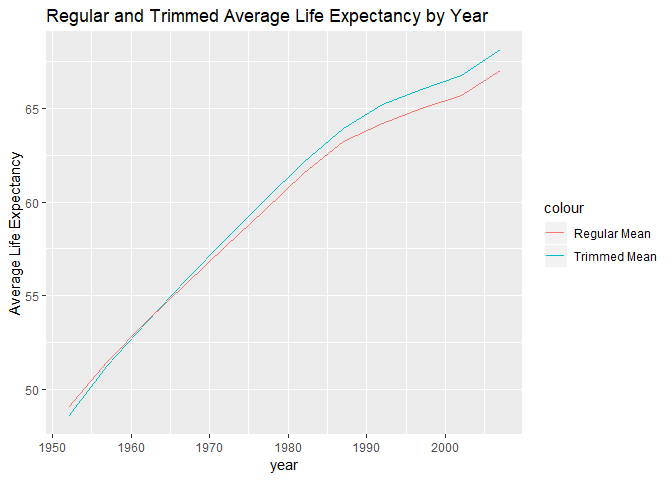<!-- -->

### Weighted mean of `lifeExp`by population

We can compute weighted mean of `lifeExp` by giving more value to countries with higher population.We will also compute regular mean for comparison purposes and arrange outcomes by year.

```r
MeanWeighted = gapminder %>% ## create a new data frame
  group_by(year) %>% ## group by year
  summarize(WeightedMean = round(weighted.mean(lifeExp, pop),2),    
            RegularMean=round(mean(lifeExp),2)) %>% ## calculate weighted and regular mean
  arrange(year)  ## arrange data by year 

knitr::kable(MeanWeighted, format = "markdown") ## knit the table
```


| year| WeightedMean| RegularMean|
|----:|------------:|-----------:|
| 1952|        48.94|       49.06|
| 1957|        52.12|       51.51|
| 1962|        52.32|       53.61|
| 1967|        56.98|       55.68|
| 1972|        59.51|       57.65|
| 1977|        61.24|       59.57|
| 1982|        62.88|       61.53|
| 1987|        64.42|       63.21|
| 1992|        65.65|       64.16|
| 1997|        66.85|       65.01|
| 2002|        67.84|       65.69|
| 2007|        68.92|       67.01|

Let's visualize weighted mean and regular mean in a time-plot

```r
MeanWeighted %>% ## access the data frame
  ggplot(aes(year)) + ## specify x-axis
  geom_line(aes(y = WeightedMean, colour = "Weighted Mean")) + ## add WeightedMean plot
  geom_line(aes(y = RegularMean, colour = "Regular Mean")) + ## add RegularMean plot
  ylab("Average Life Expectancy")+ ## change y-axis label
  labs(title="Regular and Weighted by Population Average Life Expectancy by Year") ## add a title
```

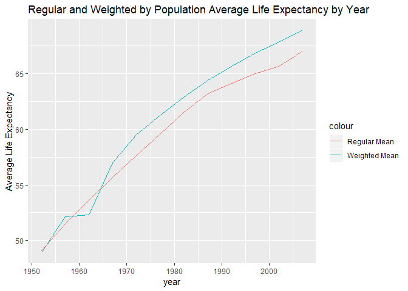<!-- -->

## 4. How is life expectancy changing over time on different continents?

### Summary table for max, mean and min for `lifeExp`

I will create a table showing max, mean and min life expectancy for every continent in any given year

```r
LifeExp_Continent_Year = gapminder %>% ## create a new data frame
  group_by(continent, year) %>% ## group by continent and year
  summarize(maxlifeExp=round(max(lifeExp),2),
            meanlifeExp=round(mean(lifeExp),2),
            minlifeExp=round(min(lifeExp),2)) %>% ## calculate max, min and mean life expectancy
  arrange(continent, year)  ## arrange data by continent and year 

knitr::kable(LifeExp_Continent_Year, format = "markdown") ## knit the table
```


|continent | year| maxlifeExp| meanlifeExp| minlifeExp|
|:---------|----:|----------:|-----------:|----------:|
|Africa    | 1952|      52.72|       39.14|      30.00|
|Africa    | 1957|      58.09|       41.27|      31.57|
|Africa    | 1962|      60.25|       43.32|      32.77|
|Africa    | 1967|      61.56|       45.33|      34.11|
|Africa    | 1972|      64.27|       47.45|      35.40|
|Africa    | 1977|      67.06|       49.58|      36.79|
|Africa    | 1982|      69.89|       51.59|      38.45|
|Africa    | 1987|      71.91|       53.34|      39.91|
|Africa    | 1992|      73.61|       53.63|      23.60|
|Africa    | 1997|      74.77|       53.60|      36.09|
|Africa    | 2002|      75.74|       53.33|      39.19|
|Africa    | 2007|      76.44|       54.81|      39.61|
|Americas  | 1952|      68.75|       53.28|      37.58|
|Americas  | 1957|      69.96|       55.96|      40.70|
|Americas  | 1962|      71.30|       58.40|      43.43|
|Americas  | 1967|      72.13|       60.41|      45.03|
|Americas  | 1972|      72.88|       62.39|      46.71|
|Americas  | 1977|      74.21|       64.39|      49.92|
|Americas  | 1982|      75.76|       66.23|      51.46|
|Americas  | 1987|      76.86|       68.09|      53.64|
|Americas  | 1992|      77.95|       69.57|      55.09|
|Americas  | 1997|      78.61|       71.15|      56.67|
|Americas  | 2002|      79.77|       72.42|      58.14|
|Americas  | 2007|      80.65|       73.61|      60.92|
|Asia      | 1952|      65.39|       46.31|      28.80|
|Asia      | 1957|      67.84|       49.32|      30.33|
|Asia      | 1962|      69.39|       51.56|      32.00|
|Asia      | 1967|      71.43|       54.66|      34.02|
|Asia      | 1972|      73.42|       57.32|      36.09|
|Asia      | 1977|      75.38|       59.61|      31.22|
|Asia      | 1982|      77.11|       62.62|      39.85|
|Asia      | 1987|      78.67|       64.85|      40.82|
|Asia      | 1992|      79.36|       66.54|      41.67|
|Asia      | 1997|      80.69|       68.02|      41.76|
|Asia      | 2002|      82.00|       69.23|      42.13|
|Asia      | 2007|      82.60|       70.73|      43.83|
|Europe    | 1952|      72.67|       64.41|      43.59|
|Europe    | 1957|      73.47|       66.70|      48.08|
|Europe    | 1962|      73.68|       68.54|      52.10|
|Europe    | 1967|      74.16|       69.74|      54.34|
|Europe    | 1972|      74.72|       70.78|      57.01|
|Europe    | 1977|      76.11|       71.94|      59.51|
|Europe    | 1982|      76.99|       72.81|      61.04|
|Europe    | 1987|      77.41|       73.64|      63.11|
|Europe    | 1992|      78.77|       74.44|      66.15|
|Europe    | 1997|      79.39|       75.51|      68.83|
|Europe    | 2002|      80.62|       76.70|      70.84|
|Europe    | 2007|      81.76|       77.65|      71.78|
|Oceania   | 1952|      69.39|       69.25|      69.12|
|Oceania   | 1957|      70.33|       70.30|      70.26|
|Oceania   | 1962|      71.24|       71.09|      70.93|
|Oceania   | 1967|      71.52|       71.31|      71.10|
|Oceania   | 1972|      71.93|       71.91|      71.89|
|Oceania   | 1977|      73.49|       72.85|      72.22|
|Oceania   | 1982|      74.74|       74.29|      73.84|
|Oceania   | 1987|      76.32|       75.32|      74.32|
|Oceania   | 1992|      77.56|       76.94|      76.33|
|Oceania   | 1997|      78.83|       78.19|      77.55|
|Oceania   | 2002|      80.37|       79.74|      79.11|
|Oceania   | 2007|      81.23|       80.72|      80.20|

### Max `lifeExp`
Let's visualize maximum life expectancy by continent over years

```r
LifeExp_Continent_Year %>% ## access the data frame
    ggplot(aes(year, maxlifeExp, color=continent))+ ## specify x and y-axis, color by continent
  geom_point()+ # add points
  geom_line()+ # add a line connecting the points for each continent
  ylab("Maximum Life Expectancy")+ ## change y-axis label
  labs(title="Maximum Life Expectancy (grouped by continent)") ## add a title
```

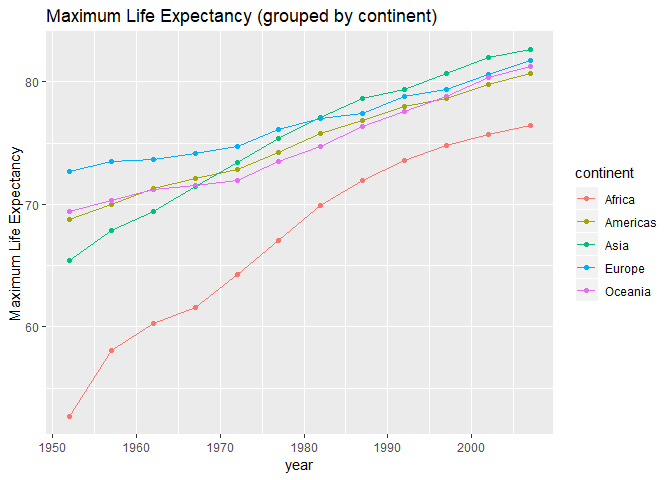<!-- -->

### Mean `lifeExp`
Let's visualize average life expectancy by continent over years

```r
LifeExp_Continent_Year %>% ## access the data frame
    ggplot(aes(year, meanlifeExp, color=continent))+ ## specify x and y-axis, color by continent
  geom_point()+ # add points
  geom_line()+ # add a line connecting the points for each continent
  ylab("Average Life Expectancy")+ ## change y-axis label
  labs(title="Average Life Expectancy (grouped by continent)") ## add a title
```

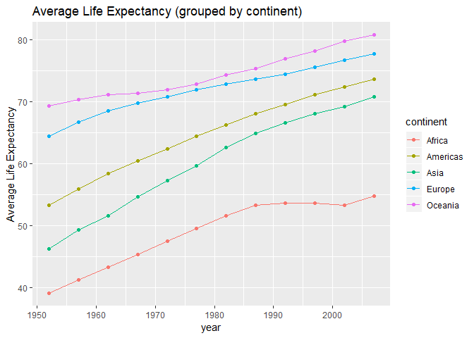<!-- -->

### Min `lifeExp`
Let's visualize minimum life expectancy by continent over years

```r
LifeExp_Continent_Year %>% ## access the data frame
    ggplot(aes(year, minlifeExp, color=continent))+ ## specify x and y-axis, color by continent
  geom_point()+ # add points
  geom_line()+ # add a line connecting the points for each continent
  ylab("Minimum Life Expectancy")+ ## change y-axis label
  labs(title="Minimum Life Expectancy (grouped by continent)") ## add a title
```

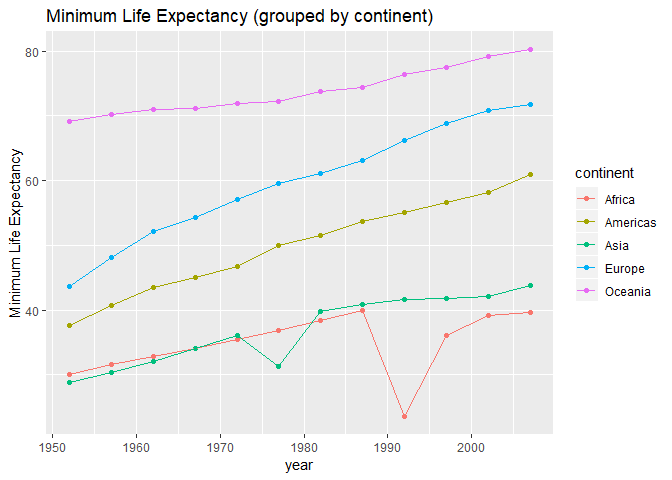<!-- -->

### Alternative approach using facet wrapping
A different way to visualize this is by using `facet_wrap` function and aggregating life expectancy timeplots by continent


```r
LifeExp_Continent_Year %>% ## access the data frame
  ggplot(aes(year)) + ## specify x-axis
  geom_line(aes(y = maxlifeExp, colour = "Max Life Expectancy")) + ## add maxlifeExp plot 
    geom_line(aes(y = meanlifeExp, colour = "Mean Life Expectancy")) + ## add meanlifeExp plot 
    geom_line(aes(y = minlifeExp, colour = "Min Life Expectancy")) + ## add minlifeExp plot 
  ylab("Life Expectancy") + ## change y-axis label
  facet_wrap(~continent) + ## facet the graphs together
  labs(title="Life Expectancy Measures (grouped by continent)") ## add a title
```

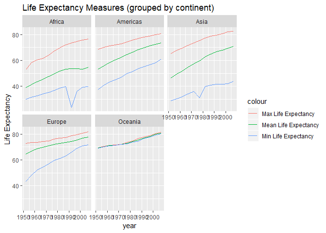<!-- -->


## 5. The relative abundance of countries with low life expectancy over time by continent

### Calculating benchmark
I will be using the 40th percentile of `lifeExp` variable.

```r
gapminder %>% ## access the dataset
  summarize(FortyPerc_lifeExp=round(quantile(lifeExp,0.4),2)) %>% ## calculate Q3 for life expectancy
  knitr::kable(format = "markdown")  ## knit the table
```


| FortyPerc_lifeExp|
|-----------------:|
|             55.73|

The 40th percentile of life expectancy equals to 55.73.

### Generating data frame

I need to generate a new data frame Benchmark by adding two more columns: Threshold and Above. Threshold column tells you whether each selected country is above or below the calculated 40th percentile. Above column gives 1 to countries that are above the benchmark and 0 if they are below.

```r
Benchmark = gapminder %>% ## create a data frame
  transmute(country, continent, year, lifeExp, Threshold = if_else(lifeExp > 55.73, "Above", "Below"), Above = if_else(lifeExp > 55.73, 1, 0)) %>%  ## add two columns
  arrange(year, continent, country) ## arrange the data year, continent and country

## We don't want to showcase the whole dataframe as that would include all the gapminder row entries.
```

### Creating a table for proportions

Create a table showing proportions of countries with life expectancy above the threshold for each continent and year

```r
Benchmark_Continent=Benchmark %>%  ## create a new data frame
  group_by(continent, year) %>%  ## group by continent and year
  summarize(propAbove=round(sum(Above)/length(Above),2)) ## compute proportions of countries with life expectancy above the threshold for each continent and year

knitr::kable(Benchmark_Continent, format = "markdown") ## knit the table
```


|continent | year| propAbove|
|:---------|----:|---------:|
|Africa    | 1952|      0.00|
|Africa    | 1957|      0.02|
|Africa    | 1962|      0.04|
|Africa    | 1967|      0.04|
|Africa    | 1972|      0.08|
|Africa    | 1977|      0.19|
|Africa    | 1982|      0.29|
|Africa    | 1987|      0.38|
|Africa    | 1992|      0.42|
|Africa    | 1997|      0.33|
|Africa    | 2002|      0.33|
|Africa    | 2007|      0.40|
|Americas  | 1952|      0.40|
|Americas  | 1957|      0.52|
|Americas  | 1962|      0.60|
|Americas  | 1967|      0.76|
|Americas  | 1972|      0.76|
|Americas  | 1977|      0.92|
|Americas  | 1982|      0.92|
|Americas  | 1987|      0.96|
|Americas  | 1992|      0.96|
|Americas  | 1997|      1.00|
|Americas  | 2002|      1.00|
|Americas  | 2007|      1.00|
|Asia      | 1952|      0.21|
|Asia      | 1957|      0.24|
|Asia      | 1962|      0.36|
|Asia      | 1967|      0.45|
|Asia      | 1972|      0.58|
|Asia      | 1977|      0.73|
|Asia      | 1982|      0.85|
|Asia      | 1987|      0.85|
|Asia      | 1992|      0.91|
|Asia      | 1997|      0.97|
|Asia      | 2002|      0.97|
|Asia      | 2007|      0.97|
|Europe    | 1952|      0.90|
|Europe    | 1957|      0.97|
|Europe    | 1962|      0.97|
|Europe    | 1967|      0.97|
|Europe    | 1972|      1.00|
|Europe    | 1977|      1.00|
|Europe    | 1982|      1.00|
|Europe    | 1987|      1.00|
|Europe    | 1992|      1.00|
|Europe    | 1997|      1.00|
|Europe    | 2002|      1.00|
|Europe    | 2007|      1.00|
|Oceania   | 1952|      1.00|
|Oceania   | 1957|      1.00|
|Oceania   | 1962|      1.00|
|Oceania   | 1967|      1.00|
|Oceania   | 1972|      1.00|
|Oceania   | 1977|      1.00|
|Oceania   | 1982|      1.00|
|Oceania   | 1987|      1.00|
|Oceania   | 1992|      1.00|
|Oceania   | 1997|      1.00|
|Oceania   | 2002|      1.00|
|Oceania   | 2007|      1.00|

### Visualizing results

Visualize this table with year on x-axis, proportions on y-axis, grouped by continent

```r
Benchmark_Continent %>%  ## access the data frame
  ggplot(aes(year, propAbove, color=continent))+ ## specify x and y-axis, color by continent
  geom_point()+ # add points
  geom_line()+ # add a line connecting the points for each continent
  ylab("Proportion of countries above the benchmark")+ ## change y-axis label
  labs(title="Proportion of countries with life expectancy above 40th percentile") ## add a title
```

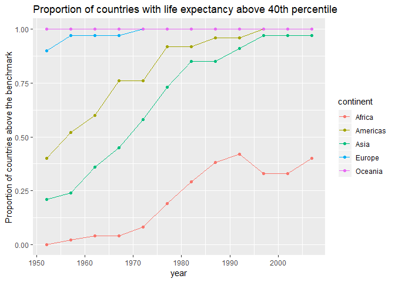<!-- -->
